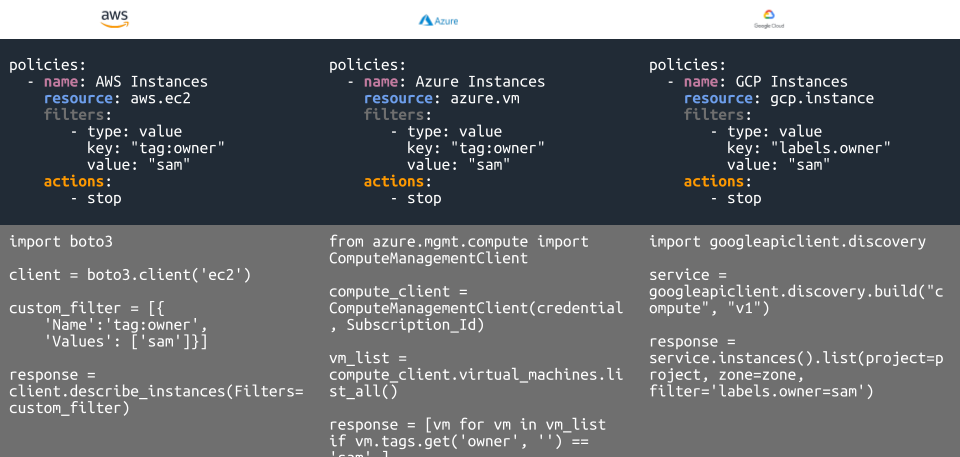

---
hide:
  - navigation
  - toc
---

# The Path to a Well Managed Cloud

Cloud Custodian enables you to manage your cloud resources by filtering, tagging, and then applying actions to them. The YAML DSL allows defininition of rules to enable well-managed cloud infrastructure that's both secure and cost optimized. 

Replace ad-hoc cloud-specific scripts with simpler syntax, and Cloud Custodian will apply those policies to your infrastructure:

[Join our Slack](https://communityinviter.com/apps/cloud-custodian/c7n-chat){ .md-button .md-button-primary }

Custodian supports managing AWS, Azure, and GCP public cloud environments with Kubernetes, Tencent Cloud, and OpenStack support in beta. 

-   :material-clock-fast:{ .lg .middle } __Real-time Compliance__

    ---

    Custodian can actively enforce security policies by natively integrating with the cloud provider's control plane and remediating in real-time. Includes with unified metrics and reporting.

    [:octicons-arrow-right-24: Getting started](#)

-   :fontawesome-solid-money-bills:{ .lg .middle } __Cost Management__

    ---

    Setup off-hours to save money by turning off resources when they're not being used. Garbage collect unused resources by looking into utilization metrics. Easily tag and reap unused resources. 

    [:octicons-arrow-right-24: Off Hours](#)

-   :material-chevron-triple-left:{ .lg .middle } __Shift Left__

    ---

    Integrate Custodian with Terraform to ensure your infrastructure comes up compliant right from the start, all defined in git for true "Governance as Code" benefits. This feature is currently in Alpha.

    [:octicons-arrow-left-24: Shift Left](https://github.com/cloud-custodian/cloud-custodian/issues/5782)

-   :fontawesome-solid-laptop-code:{ .lg .middle } __Run Anywhere__

    ---

    Custodian can be run locally, on an instance, or Serverless in AWS Lambda.

    [:octicons-arrow-right-24: License](#)

-   :fontawesome-brands-osi:{ .lg .middle } __Open Source__

    ---

    Cloud Custodian is open source and free for everyone to use and is a [CNCF Incubating Project](https://www.cncf.io/projects/) under the [Apache 2.0 license](https://github.com/cloud-custodian/cloud-custodian/blob/master/LICENSE).

    [:octicons-arrow-right-24: CNCF](https://www.cncf.io/projects/)

-   :material-file-code-outline:{ .lg .middle } __Simple DSL__

    ---

    Use Custodian to build complex workflows or simple queries, millions of policies can be constructed using our easy to read DSL (Domain Specific Language).

    [:octicons-arrow-right-24: Examples](https://cloudcustodian.io/docs/aws/examples/index.html)

